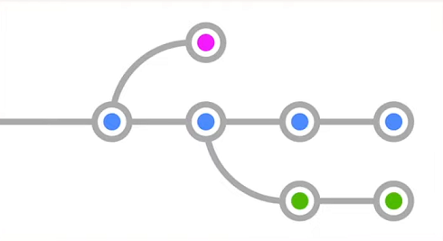

##### Update: July-2022

## GitHub Basic

 

#### 1. Tools

1. **Gitbash** _= MINGW64 Terminal_ : Git default console
2. **sourcetree**: GUI-based git management
3. **VisualStudioCode**: Code editor
    - Use **Git Bash** terminal (_CTL + ` to open terminal -> select Git Bash_)

 

#### 2. git shell commands

: Refer to [git documents](https://git-scm.com/docs)

##### 2-1. Create Account

-   `git config --list` // open global configuration file at _c:/Users/your-account-id/.gitconfig_
-   `git config --global -e` // open global configuration file on editing mode
-   `code .` // open visual studio code editor
-   `git config --global core.editor "code"`
-   `git config --global -e` // open global configuration file by visual studio code
-   `git config --global user.name "your-name"`
-   `git config --global user.email "your-email@email"`
-   `git config user.name` // return your name
-   `git config user.email` // return your email
-   `git config --global core.autocrlf true"` // for window users, set automate crlf management between _local-machine <~> github-server_

##### 2-2. git install and management

-   `mkdir WorkingProjects`
-   `cd WorkingProjects`
-   `mkdir git`
-   `cd git`
-   `git init`
-   `ls -a`
-   `cd .git`
-   `ls`
-   `cd ..`
-   `git status`
-   `git config --global alias.st status`
-   `git st`
-   `git status --h`

##### 2-3. file management: staging, commit

1. Working directory
    - Untracked files : Before "git add"
    - Tracked files : After "git add"
2. Staging area : Before "git commit"
3. .git directory : Committed
4. Remote server : `git push` or `git pull`

-   `echo hello world > a.txt`
-   `echo hello world > b.txt`
-   `echo hello world > c.txt`
-   `git status`
-   `git add a.txt`
-   `git status`
-   `git add *.txt`
-   `git status`
-   `echo Sam > a.txt`
-   `git status`
-   `git rm --cached *`
-   `git status`
-   `ls`
-   `git add *`
-   `git status`
-   `rm a.txt`
-   `git status`
-   `git add .`
-   `git status`
-   `echo styling >> style.css`
-   `echo log > log.log`
-   `git status`
-   `git add *.css`
-   `git status`

-   `git commit -m "first commit"` // need to set meaningful scope and name for commit
-   `git log`
-   `echo add >> c.txt`
-   `git commit -am "second commit"`
-   `git log`

##### 2-4. git ignore: save directories/files to "_.gitignore_"

-   `echo *.log > .gitignore`
-   `ls -al`
-   `cat .gitignore`
-   `git status`
-   `nano .gitignore` // add \*.log, build/
-   `cat .gitignore`

-   `git status -s`
-   `echo add > c.txt`
-   `git status -s`
-   `git status`

##### 2-5. Inspect what has changed

-   `git diff`
-   `git diff --staged`
-   `git diff -h`
-   `git diff --cached`

-   `git config --config -e`

##### 2-6. Remove git commit history -> Re-initialize repository

-   `rm -rf .git`
-   `ls -al`
-   `git init`
-   `git add .`
-   `git status`
-   `git commit -m "Initial commit"`
-   `git status`
-   `git remote add origin github.com:your-id/your-repo.git`
-   `git push -u --force origin master`

##### 2-7. Undo commits : Reset vs. Revert

1. **Reset**: deletes a commit history(histories) to return to specific version.

    - cannot trace the history of deletion.
    - must not be used if the codes are shared with other developers before.

2. **Revert**: cancel a commit history.

    - can trace the history of deletion
    - use when you want to remove a specific commit from the list of commit history
    - use for codes shared with other developers before

-   `git log`
-   `git reset --hard hash-code-where-you-want-to-return`
-   `git log`
-   `git revert hash-code-you-want-to-cancel`

##### 2-8. git branch management

1.  Manage multiple processes for different purposes
    -   distribution server, test server, new trial, etc.
2.  Manage independent jobs

    -   code refactoring, new function implementation, urgent maintainence, etc.

    

2-8-1. Create branch

-   `git branch add-coach` // create a branch in a name of add-coach
-   `git branch` // check branch list
-   `git switch add-coach` // move to add-coach branch
-   `git switch -c new-team` // create and move to new-team branch
-   `git switch master`
-   `git branch -d new-team` // delete new-team branch. must check out of the being deleted branch
-   `git branch -m add-coach add-team` // change branch name from add-coach to add-team
-   `git branch`
-   `git log -all --decorate --online --graph` // sourcetree is better

2-8-2. Merge branch : **merge** vs. **rebase**

-   `git switch master`
-   `git merge new-team1` // merge a branch to the current branch
-   `git branch -d new-team1` // delete merged branch
-   `git switch new-team2`
-   `git rebase master` // attach new-team2 branch at the front of master branch
-   `git merge new-team2` // move the master branch node to the front including new-team2 commits (must do)
-   `git branch -d new-team1` // delete rebased branch

##### 2-9. git confilict resolve

-   `git merge --abort` // if too many conflicts exist
-   `git merge confilict1`
-   `git add.`
-   `git commit`
-   `git rebase --abort`
-   `git add .`
-   `git rebase --continue`
-   `git switch master`
-   `git merge confilict2`
-   `git branch -d confilict1`
-   `git branch -d confilict2`

 

#### 3. GitHub

##### 3-1. GitHub account management

3-1-1. Personal access token

-   Create PAT: GitHub -> Settings -> Developer settings -> Personal access tokens -> Generate token
-   Save the token to notepad
-   **Windows** setup: Windows credential manager -> github url -> paste the token
-   **Sourcetree** setup: tools -> options -> paste the token

3-1-2. Create git repository

-   Can add collegues for cooperative project managemnt to each repository

3-1-3. Connect local git to GitHub

-   `git remote add origin` // can use other name instead of origin
-   `git branch -M main` // default branch name

3-1-4. Upload/Download between local repository and GitHub

-   `git push -u origin main` // connect the current folder and GitHub repository and uploads locally commited data to GitHub main brahch
-   `git remote`
-   `git remote -v`
-   `git clone GitHub-repository-url`
-   `git log`
-   `git push` // automatically update GitHub repository
-   `git pull` // automatically update local repository

3-1-5. GitHub confilict resolve: pull and then push

-   `git pull --no-rebase` // merge method
-   `git add .`
-   `git commit`
-   `git push`
-   `git pull --rebase` // rebase method
-   `git add .`
-   `git rebase --continue`
-   `git push`
-   `git push --force` // must not use until you get permission/aggrement

3-1-6. Local branch push

-   `git branch from-local`
-   `git switch from-local`
-   `git push` // if error occurs from no branch in GitHub
-   `git push -u origin from-local` // creates from-local branch in GitHub
-   `git branch --all`
-   `git branch -a`

3-1-7. GitHub branch pull

-   `git branch -a`
-   `git fetch`
-   `git branch -a`
-   `git switch -t origin/from-remote`
-   `git push origin --delete from-local` // deletes GitHub branch
-   ` git push origin --delete from-local`
